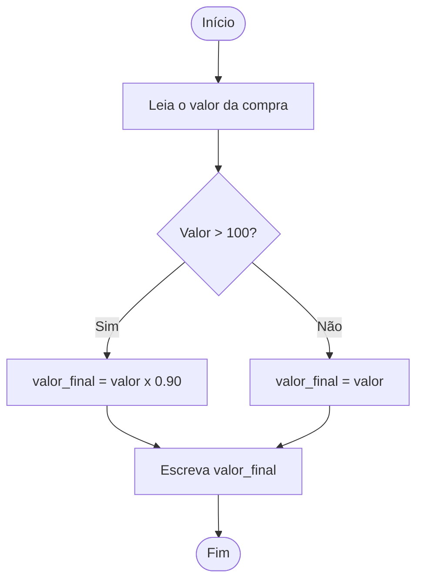

```mermaid
flowchart TD
    A([Início]) --> B[Leia o valor da compra]
    B --> C{Valor > 100?}
    C -->|Sim| D[valor_final = valor x 0.90]
    C -->|Não| E[valor_final = valor]
    D --> F[Escreva valor_final]
    E --> F
    F --> G([Fim])
```